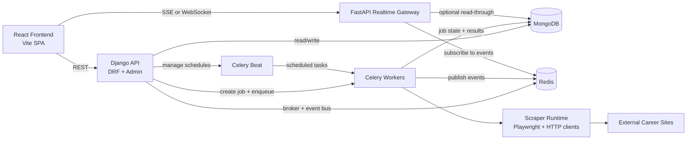
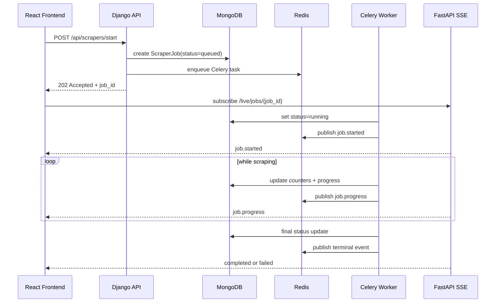
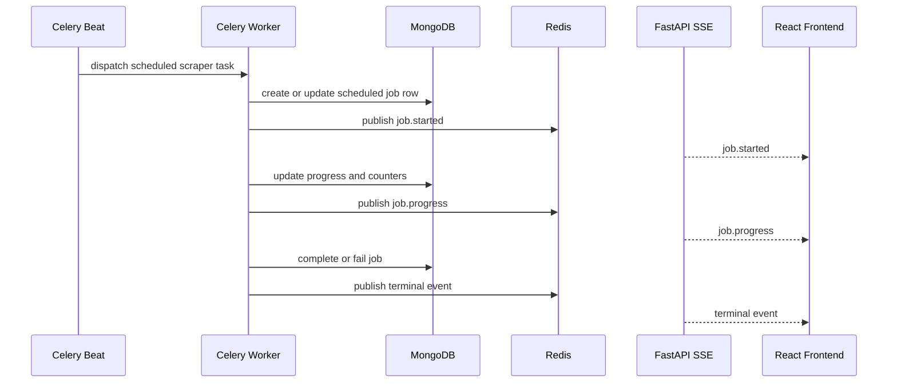
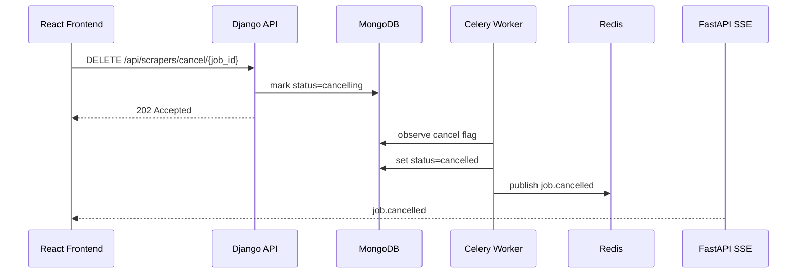

# AeroOps Target Architecture And Migration Plan

This document turns the current scraper service into a concrete target design for:

- Django as the management and control plane
- Celery + Redis for scraper execution and scheduling
- FastAPI for realtime streaming only
- MongoDB as the persistent store

It is written against the current repo state, where:

- Django + DRF already owns scraper management APIs
- `django_celery_beat` is referenced, but there is no real Celery app or worker wiring yet
- the frontend uses polling instead of push updates
- scraper runs are still launched from API code with background subprocesses

## Goals

- Keep one source of truth for scraper state and management logic
- replace subprocess-based execution with queued worker execution
- support reliable scheduling, retries, cancellation, and concurrency control
- provide low-latency live updates to the frontend without heavy polling
- keep deployment and ownership boundaries simple enough to operate

## Non-Goals

- FastAPI will not own scheduler state, auth, scraper config CRUD, or job history CRUD
- the frontend will not talk directly to Redis or Celery
- management endpoints will not be duplicated across Django and FastAPI

## Current Baseline

The important repo facts today are:

- Django entrypoints and routing live in `scraper_service/`
- scraper APIs and models live in `scraper_manager/`
- DB utilities live in `db_manager/`
- the frontend uses Axios and React Query polling from `frontend/src/`
- `service.sh` starts only Django and the built frontend
- `requirements.txt` includes `django-celery-beat` and `uvicorn`, but there is no Celery app or FastAPI app in the repo

## Target Topology



## Service Responsibilities

### Django

Django remains the control plane.

Owns:

- auth and dashboard session handling
- scraper config CRUD
- manual start and cancel requests
- schedule CRUD and schedule visibility
- history, metrics, and reporting APIs
- DB backup and restore APIs
- admin and operational commands
- the canonical `ScraperJob` state in MongoDB

Does not own:

- long-running execution threads
- direct subprocess launching after migration is complete
- push transport to the browser

### Celery Workers

Celery workers become the only execution path for scrapers.

Owns:

- scraper execution
- retry and timeout policy
- per-scraper concurrency policy
- cooperative cancellation checks
- live progress emission
- terminal state emission

### Redis

Redis is used for:

- Celery broker
- optional Celery result backend
- pub/sub event channel for live status
- lightweight coordination such as worker heartbeats and queue depth snapshots

### Celery Beat

Beat becomes the only scheduler.

Owns:

- scheduled scraper dispatch
- periodic cleanup jobs
- periodic verification jobs
- periodic reporting or maintenance jobs

### FastAPI

FastAPI is a thin realtime gateway.

Owns:

- SSE or WebSocket connections for live updates
- subscription authorization based on Django-issued tokens or shared signing
- event fan-out from Redis to browser clients

Does not own:

- start or stop mutations
- scraper config writes
- scheduler writes
- business rules that already live in Django

### Frontend

The frontend uses:

- Django REST for commands and durable queries
- FastAPI stream for active-job state

The frontend should stop polling high-frequency endpoints once streaming is in place, except as a fallback.

## Recommended Transport Choice

Start with SSE, not WebSockets.

Reason:

- the dashboard mainly needs server-to-client updates
- SSE is simpler to operate through proxies
- reconnection behavior is easier
- the browser-side integration is smaller

Use WebSockets only if the live channel later needs bidirectional control semantics beyond status streaming.

## Target Module Layout

Add the following modules over time.

```text
scraper_service/
  celery.py                 # Celery app bootstrap
  settings.py               # Add Celery and Redis config

scraper_manager/
  tasks.py                  # Celery tasks for run/cancel/maintenance
  services/
    job_dispatcher.py       # Job creation and enqueue logic
    job_events.py           # Publish normalized lifecycle events
    job_state.py            # State transition helpers
    scheduler_service.py    # Sync config to beat tasks
  api.py                    # Stop launching subprocesses directly
  models.py                 # Expand job fields/state machine

realtime_gateway/
  __init__.py
  main.py                   # FastAPI app
  auth.py                   # Shared token validation/signing
  redis_subscriber.py       # Subscribe to Redis channels
  routers/
    live.py                 # /live, /jobs/{job_id}/events
  schemas.py                # Stream payload schemas

shared/
  __init__.py
  event_types.py            # event names/constants
  event_schema.py           # normalized event payload helpers
```

`shared/` is optional, but it helps avoid drift between Django worker events, FastAPI streaming, and frontend parsing.

## Canonical Job State Machine

`ScraperJob.status` should move to a strict state machine:

- `queued`
- `running`
- `cancelling`
- `cancelled`
- `completed`
- `failed`
- `retrying`

Additional job fields recommended for `ScraperJob`:

- `task_id`
- `worker_name`
- `queue_name`
- `progress_message`
- `heartbeat_at`
- `cancel_requested_at`
- `started_by`
- `failure_code`
- `failure_context`
- `attempt_count`

## API Boundary

### Django REST Endpoints

Remain in Django:

- `POST /api/scrapers/start/`
- `POST /api/scrapers/start-all/`
- `DELETE /api/scrapers/cancel/{job_id}/`
- `GET /api/scrapers/active/`
- `GET /api/scrapers/history/`
- `GET /api/scrapers/stats/`
- `GET /api/scrapers/configs/`
- `PATCH /api/scrapers/config/{scraper_name}/update/`
- `GET /api/scrapers/scheduler/overview/`
- DB backup and restore endpoints under `api/db/`

The start endpoints should return `202 Accepted` with a job record instead of implying immediate execution.

### FastAPI Live Endpoints

Add:

- `GET /live/events` for global dashboard SSE
- `GET /live/jobs/{job_id}` for per-job SSE
- optional `GET /live/workers` for worker heartbeat stream

If WebSockets are eventually used:

- `GET /ws/events`
- `GET /ws/jobs/{job_id}`

## Event Contract

Workers publish a normalized envelope to Redis.

```json
{
  "event": "job.progress",
  "job_id": "12345",
  "scraper_name": "emirates",
  "status": "running",
  "progress": 42,
  "message": "Fetched page 3 of 8",
  "jobs_found": 120,
  "jobs_new": 18,
  "jobs_updated": 7,
  "jobs_duplicate": 95,
  "attempt_count": 1,
  "timestamp": "2026-04-17T10:15:30Z"
}
```

Event names:

- `job.queued`
- `job.started`
- `job.progress`
- `job.retrying`
- `job.cancel_requested`
- `job.cancelled`
- `job.completed`
- `job.failed`
- `worker.heartbeat`
- `queue.depth`

## Request Flows

### Manual Start Flow



### Scheduled Flow



### Cancel Flow



## Migration Phases

### Phase 0: Preparation

Objectives:

- freeze current execution paths and document them
- add explicit status naming and response shape expectations
- add integration tests around current start, cancel, history, and config endpoints

Deliverables:

- architecture doc in repo
- tests protecting existing API contract where needed
- inventory of all direct execution paths

Exit criteria:

- no unknown code path starts a scraper without being documented

### Phase 1: Celery And Redis Foundation

Objectives:

- add Redis dependency and config
- add a real Celery app bootstrap
- add a worker process that can run a simple health task

Deliverables:

- `scraper_service/celery.py`
- Celery settings in Django settings
- worker startup command
- basic queue health endpoint or command

Exit criteria:

- a test task can be enqueued and executed successfully

### Phase 2: Taskize Scraper Execution

Objectives:

- move manual scraper execution into Celery tasks
- stop using `subprocess.Popen` in API paths

Deliverables:

- `scraper_manager/tasks.py`
- `job_dispatcher.py`
- updated `start` and `start-all` endpoints returning queued jobs

Exit criteria:

- starting any scraper from the API creates a queued job and routes execution through Celery only

### Phase 3: State Machine And Cancellation

Objectives:

- formalize status transitions
- add worker identity, task id, attempts, and progress fields
- support cooperative cancellation

Deliverables:

- model changes in `scraper_manager/models.py`
- shared transition helpers
- cancel-aware worker logic

Exit criteria:

- active jobs can be cancelled without orphaned processes
- history reflects accurate terminal states

### Phase 4: Scheduler Consolidation

Objectives:

- make Beat the only scheduler
- sync scraper config schedule fields into beat tasks cleanly

Deliverables:

- `scheduler_service.py`
- updated schedule sync logic
- cleanup of old mixed scheduling behavior

Exit criteria:

- manual execution and scheduled execution both route through the same Celery task path

### Phase 5: Realtime Event Pipeline

Objectives:

- publish normalized lifecycle events from workers
- add FastAPI SSE gateway backed by Redis subscription

Deliverables:

- `realtime_gateway/main.py`
- Redis subscriber
- live event schemas

Exit criteria:

- a running scraper can be observed live from the browser without polling active-job endpoints every few seconds

### Phase 6: Frontend Migration

Objectives:

- replace high-frequency polling for active work with SSE updates
- keep REST for durable reads and commands

Deliverables:

- live client in frontend
- cache reconciliation for `activeJobs`, `activeMonitor`, and metrics
- polling reduced to fallback mode only

Exit criteria:

- dashboard remains accurate during runs while dramatically reducing repeated HTTP calls

### Phase 7: Runtime And Deployment

Objectives:

- update service startup to include Django, worker, beat, Redis, and FastAPI
- separate logging and health checks per process

Deliverables:

- updated `service.sh` or separate supervisor/systemd definitions
- process health checks
- startup documentation

Exit criteria:

- all runtime components can start, stop, and report health independently

### Phase 8: Decommission Legacy Paths

Objectives:

- remove direct subprocess execution paths
- remove high-frequency polling defaults
- remove dead schedule helpers and thread-based admin runners if redundant

Exit criteria:

- there is one execution path, one scheduler path, and one live-update path

## Repo-Specific Changes To Make

### Files To Update First

- `scraper_service/settings.py`
- `scraper_manager/api.py`
- `scraper_manager/models.py`
- `scraper_manager/management/commands/run_scraper.py`
- `service.sh`
- `frontend/src/hooks/useScrapers.ts`
- `frontend/src/services/api.ts`

### Files To Add Early

- `scraper_service/celery.py`
- `scraper_manager/tasks.py`
- `scraper_manager/services/job_dispatcher.py`
- `scraper_manager/services/job_events.py`
- `scraper_manager/services/job_state.py`
- `realtime_gateway/main.py`
- `realtime_gateway/routers/live.py`

## Operational Plan

### Development Runtime

Target local process set:

- Redis
- Django API
- Celery worker
- Celery Beat
- FastAPI realtime gateway
- frontend dev server or built frontend

### Production Runtime

Target production process set:

- Gunicorn for Django
- Uvicorn for FastAPI realtime
- Celery worker pool
- Celery Beat
- Redis
- static frontend hosting

## Risks And Mitigations

### Risk: Duplicate Business Logic

If FastAPI starts owning start or cancel semantics, job state will drift.

Mitigation:

- keep all mutations in Django
- keep FastAPI read-stream only

### Risk: Orphaned Browsers Or Scraper Processes

Current direct execution patterns can leave unmanaged runs.

Mitigation:

- route everything through Celery
- implement cooperative cancellation and heartbeat monitoring

### Risk: Event Drift Between Worker And Frontend

If event payloads are ad hoc, the dashboard becomes fragile.

Mitigation:

- define one envelope schema in shared code
- version event payloads if needed

### Risk: Too Many Realtime Connections

If every page opens many streams, resource usage spikes.

Mitigation:

- use one global dashboard stream and optional per-job streams only when needed

## Acceptance Checklist

- manual start no longer launches a subprocess from API code
- scheduled runs and manual runs use the same Celery task path
- a running scraper emits live progress without 2-second polling
- cancellation is visible in UI and reflected in persistent history
- Beat is the only scheduler
- Django remains the only mutation API
- FastAPI streams events only

## Recommended Execution Order

Build in this order:

1. Celery app + Redis wiring
2. queue-backed manual start
3. state machine + cancellation
4. Beat scheduler consolidation
5. worker event publishing
6. FastAPI SSE gateway
7. frontend live integration
8. service startup and deployment changes
9. cleanup of legacy execution paths

## Immediate Next Step

The next implementation step should be:

1. add Celery and Redis wiring to the Django backend
2. replace `subprocess.Popen` job launch in `scraper_manager/api.py` with queue dispatch

Those two steps create the foundation for everything else in this architecture.